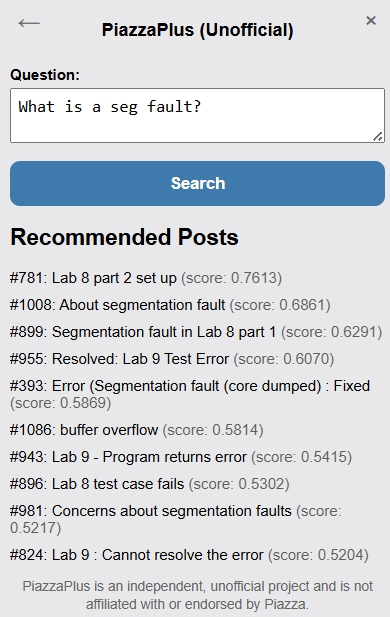

# PiazzaPlus  
> **A hybrid semantic + keyword search engine for Piazza discussion forums**  
> **Disclaimer:** *PiazzaPlus is an independent, open-source project and is not affiliated with or endorsed by Piazza.*
> **Download my version [here](chrome://extensions/)**




---

## 📌 Overview
**PiazzaPlus** is a browser extension that brings **hybrid search** to Piazza course discussion boards.
It combines **semantic search** with **BM25 keyword search** to help students quickly find relevant posts — even when their query wording differs from previous questions!

**Core features:**
- 🔍 **Hybrid Retrieval**: Combines semantic vector search and keyword matching for high recall & relevance.
- 🖥 **Chrome Extension Frontend**:  
  - Enter your Piazza course Network ID.
  - Ask natural-language questions.
  - Get clickable results that open the original post in Piazza.
- 🗄 **Python Backend**:  
  - Scrapes Piazza posts.
  - Builds a vector store using [ChromaDB] and BM25 indexes.
  - Exposes search endpoints via a Flask API.
- 🎯 **Modular Codebase**: Frontend and backend are separate, making deployment flexible.

---

## 🛠 Architecture
```
+-----------------+     HTTP API      +---------------------+
|  Chrome         |  <--------------> |  Python Flask API   |
|  Extension      |                   |  (backend)          |
|  (popup.html,   |                   |                     |
|   popup.js)     |                   |   - search.py       |
|                 |                   |   - build_db.py     |
|                 |                   |   - scraper.py      |
+-----------------+                   +---------------------+
        |
        v
User enters Network ID & query

```


### Backend Components
- **`scraper.py`** — Logs into Piazza using credentials in `auth.json`, fetches posts for each registered course, and scrapes new posts every five minutes.  
- **`build_db.py`** — Vectorizes all scraped posts and builds the hybrid index (BM25 + embeddings), and vectorizes new posts every five minutes.  
- **`search.py`** — Executes a hybrid search over the vectorized posts.
- **`search_lib.py`** — The hybrid searching function.
- **`utils.py`** — Helper functions to modulate code.
- **`api.py`** — Flask server exposing endpoints:  
  - `GET /is-registered` — checks if a network ID exists in `auth.json`  
  - `GET /search` — runs hybrid retrieval and returns top results  

### Frontend Components
- **`popup.html`** — Extension UI.
- **`popup.css`** — Styling (Piazza-inspired theme).
- **`popup.js`** — Handles user interactions and API calls. 

---

## 🚀 Getting Started (Local Development)

### 1️⃣ Backend Setup
#### Requirements:
- Python 3.13+
- `pip install -r requirements.txt`
- Piazza account + credentials for scraping.
- OpenAI API key set up in a `.env`.

#### Step 1: Configure `auth.json`
Create a file called `auth.json` in the `backend` folder with the following format:

```json
{
    "course1_nid": { 
        "email": "yourpiazzaemail@email.com", 
        "password": "yourpiazzapassword" 
    },
    "course2_nid": {
        "email": "yourpiazzaemail@email.com",
        "password": "yourpiazzapassword"
    }
}
```
- The **keys** (e.g. `course1_nid`) are Piazza **Network IDs** for each course.  
- The **values** are your Piazza login credentials for that course.

#### Step 2: Run the Scraper
```bash
cd backend
python scraper.py
```
- This fetches all posts from the courses in `auth.json`.
- Data is stored in `data\course1_nid\posts.json`.
- Runs continuously (until killed), scraping only new posts every five minutes and persisting them to each course's respective `posts.json`.

#### Step 3: Build the databases
```bash
python build_db.py
```
- Vectorizes all posts in each `posts.json` and saves each database in that course's respective data folder.
- Runs continuously (until killed), vectorizing only new posts every five minutes and storing them in each course's respective `db` folder.

#### Step 4: Search
```bash
python search.py
```
- Allows you to query posts directly against the vectorized database.

#### Step 4: Run API
```bash
python api.py
```
- Starts the Flask API so the browser extension can connect.
- The server host and port are **set directly in the frontend code**. Edit these values in `popup.js` and `manifest.json` to your own deployment server.

### 2️⃣ Frontend Setup (for Google Chrome)
1. Open `chrome://extensions` in Chrome.
2. Enable **Developer mode** (top right).
3. Click **Load unpacked** (top left) and select the `frontend` folder.
4. By default, the frontend connects to the backend URL specified in `popup.js` and `manifest.json`.

---

## 📄 Usage
1. Click the PiazzaPlus extension icon.
2. Enter a Piazza **Network ID** that you have access to (hover over the question mark tooltip to learn how to find it) and click **Next**.
3. Type your query in plain English and click **Search**.
4. Get top 10 most relevant results with clickable links to original Piazza posts.

---

## 🔒 Notes on Configuration
- Unlike some projects, there is no **config.js** file.
- The backend server hostname and port are set directly in `popop.js` and `manifest.json`.
- To deploy to a different server, simply update those files manually.

---

## 🧠 How the Hybrid Search Works
- **Sentence embeddings** (via a transformer model) capture semantic meaning.
- A loose **BM25** keyword match filters out posts from the semantic list that are not in the top 100 of keyword searching.
- This balances precision and recall.

---

## ⚠️ Disclaimer
PiazzaPlus is an **independent** project:
- It does not store or transmit your Piazza credentials.
- It is **not affiliated with or endorsed by** Piazza.

---

## 📚 License
**MIT License** — free to use, modify, and share.